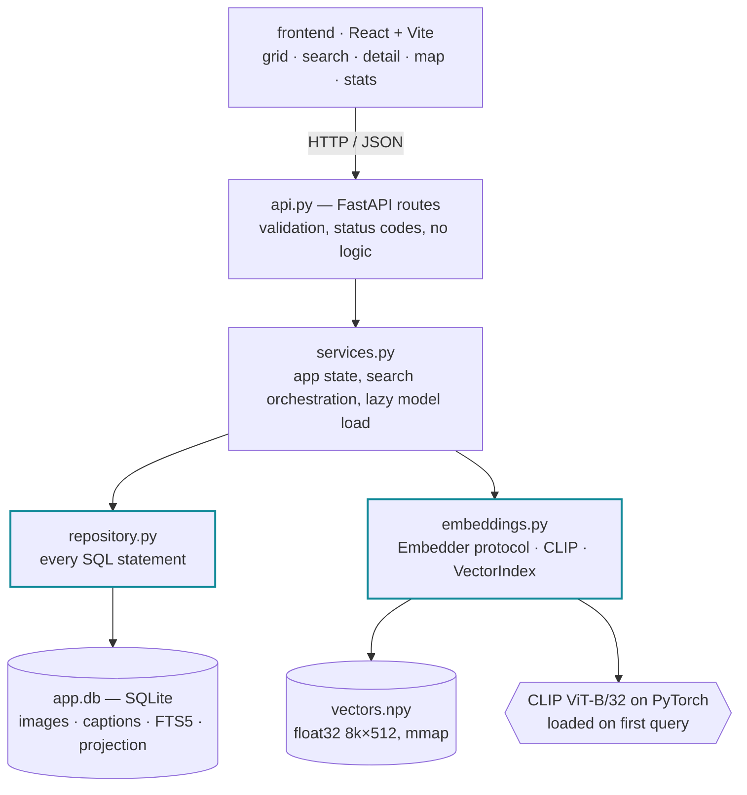
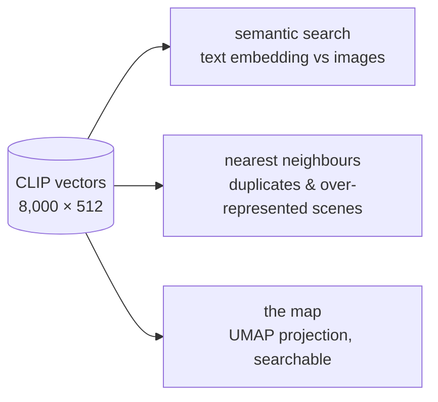
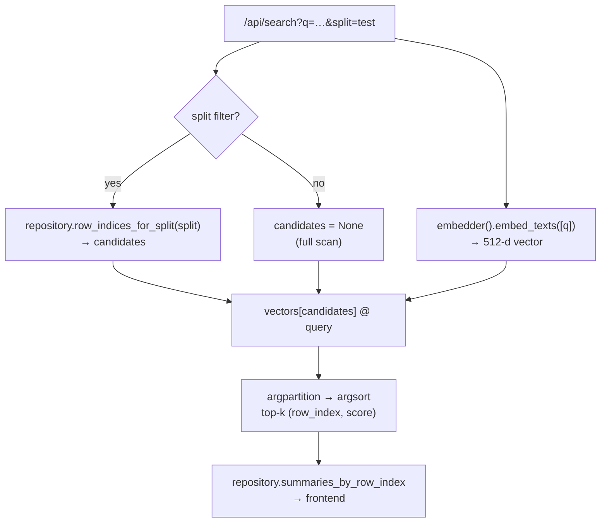
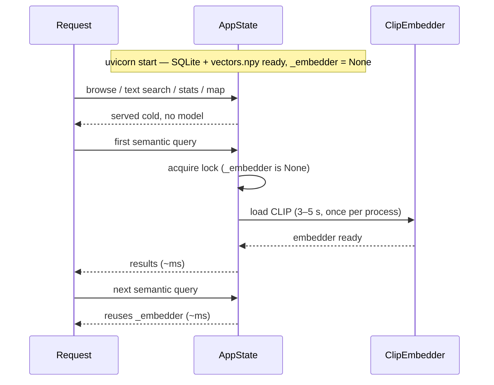
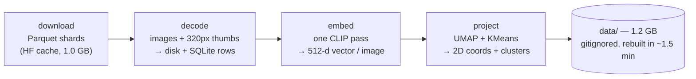

# Flickr8k Explorer

A local tool for exploring the [Flickr8k](https://huggingface.co/datasets/jxie/flickr8k) dataset
(8,000 images, 5 captions each): browse the samples, search them by meaning, inspect any example in
detail, and see the shape of the whole dataset on a 2D map of its embedding space.

Everything runs on one machine. No cloud services, no managed database, no paid APIs.

---

## TL;DR for the reviewer

Six commands (the first installs uv, and only if you do not have it yet). About 12 minutes total,
most of it downloads that only happen once.

```bash
curl -LsSf https://astral.sh/uv/install.sh | sh   # once, if you do not have uv (see Requirements)
git clone https://github.com/andybenichou/flickr8k-explorer.git && cd flickr8k-explorer
uv sync --extra dev                     # ~3 min   (downloads PyTorch)
npm --prefix frontend install           # ~15 s
uv run python -m backend.ingest         # ~7 min   (one time; see the breakdown below)
uv run uvicorn backend.app.api:app      # starts in ~2 s
```

Then, in a second terminal:

```bash
npm --prefix frontend run dev           # open http://localhost:5173
```

**In a hurry?** Replace the ingestion with `uv run python -m backend.ingest --limit 200`. It ingests
600 images instead of 8,000 and finishes in about 90 seconds after the dataset download. Every
feature works, just on a smaller set.

**Want to check it works before committing to the full run?** `uv run pytest` takes under a second
and needs neither the dataset nor the model weights.

---

## What to look at once it is running

The tool has five views. Suggested two-minute tour:

1. **Browse** — the grid, 8,000 images, scroll to load more. Filter by split in the dropdown.
2. **Search, semantic mode** — type `a dog jumping over a fence`. The top hits are dogs leaping over
   tree stumps, agility hurdles and a pole with fire on the ends. None of those captions contain the
   word "fence". This is the difference between embedding search and keyword search, and it is the
   core of what makes the tool useful.
3. **Search, caption-text mode** — run the same query with the toggle set to *Caption text*. BM25
   only matches the literal words. Comparing the two result sets tells you something real about
   annotation coverage.
4. **Click any image** — the detail panel opens: full image, all five captions with word counts,
   resolution and file metadata, and its nearest neighbours in CLIP space. Near-identical
   neighbours are duplicates or over-represented scenes.
5. **Map** — the UMAP projection of all 8,000 embeddings, coloured by cluster. Hover for a
   thumbnail, click to open the detail panel. Type a search query while on this view: the hits stay
   coloured and everything else dims, which turns the query into "where does this concept live in
   the dataset".
6. **Stats** — split sizes, caption-length distribution, resolutions, most frequent words. Note that
   "dog" appears 8,111 times across 40,000 captions. That is the dataset's content bias in one line.

One thing worth knowing: **the map shows a small detached group far to the left of the main cloud.**
That is not a rendering bug. It is a genuinely isolated group in CLIP space, and surfacing that kind
of structure is exactly what the view is for.

---

## Requirements

- **Python 3.11 or 3.12** via [uv](https://docs.astral.sh/uv/). Install uv with
  `curl -LsSf https://astral.sh/uv/install.sh | sh`. You do not need to install Python yourself, uv
  fetches the right version.
- **Node.js 18+**
- **About 4 GB of free disk space**, broken down below
- An internet connection for the first run

### Disk usage

| Location | Size | Note |
| --- | --- | --- |
| `.venv/` | 1.1 GB | Mostly PyTorch |
| `~/.cache/huggingface` (dataset) | 1.0 GB | Parquet shards, shared across runs |
| `~/.cache/huggingface` (CLIP weights) | 577 MB | Downloaded on the first embedding pass |
| `data/` | 1.2 GB | 1.0 GB images, 169 MB thumbnails, 11 MB SQLite, 16 MB vectors |

Only `data/` lives in the repo, and it is gitignored. Deleting it and re-running the ingestion
rebuilds everything from the caches in about 1.5 minutes.

---

## Setup

```bash
curl -LsSf https://astral.sh/uv/install.sh | sh   # once, if you do not have uv (see Requirements)
git clone https://github.com/andybenichou/flickr8k-explorer.git && cd flickr8k-explorer
uv sync --extra dev
npm --prefix frontend install
```

uv is a single self-contained binary, not a pip package, so it has to be installed once before the
other commands. On macOS you can also use `brew install uv`. `uv sync` creates `.venv` and installs the pinned dependencies from `uv.lock`. The slow part is
PyTorch, roughly 3 minutes on a normal connection.

---

## Step 1: ingest the dataset

```bash
uv run python -m backend.ingest
```

This is a **one-time** step. Measured on an Apple Silicon laptop, CPU only:

| Stage | Time | What it does |
| --- | --- | --- |
| download | 2 to 5 min | Pulls the parquet shards from HuggingFace. Cached, so it is free on re-runs. |
| decode | 20 s | Writes 8,000 full images and 320 px thumbnails to disk, fills SQLite (images, captions, FTS5 index). |
| embed | 59 s | CLIP ViT-B/32 over every image, ~135 images/s, into `data/embeddings.npy` (16 MB). Adds a one-off 577 MB model download the first time. |
| project | 15 s | UMAP to 2D plus KMeans clusters, written back into SQLite. |

**First run: about 7 minutes**, dominated by the two downloads. **Any later re-run: about 1.5
minutes**, since both caches are warm.

The pipeline prints a progress bar per stage, so you can see where it is.

### Flags

| Flag | Effect |
| --- | --- |
| `--limit N` | Only ingest N images per split. `--limit 200` gives 600 images in ~90 s. |
| `--only {decode,embed,project}` | Re-run a single stage against the existing database. |
| `--skip-embeddings` | Browse and caption search only, no CLIP, no semantic search, no map. |
| `--skip-projection` | Everything except the map. |

Stages are separable on purpose: embedding is the expensive one, and a failure in a later stage
should never force you to redo it.

Re-running the full ingestion is safe. It rebuilds the tables from scratch and reuses both caches.

---

## Step 2: run the application

Two terminals.

```bash
# terminal 1 - API on http://127.0.0.1:8000, interactive docs at /docs
uv run uvicorn backend.app.api:app --reload
```

```bash
# terminal 2 - UI on http://localhost:5173
npm --prefix frontend run dev
```

Open <http://localhost:5173>.

**Startup and response times:**

- The API starts in about 2 seconds. It memory-maps the vectors rather than loading them.
- Browsing, caption search and stats respond in a few milliseconds.
- **The first semantic search takes 10 to 15 seconds**, because that is when torch is imported and
  the CLIP text encoder loads. Every search after that is a few milliseconds. That is on purpose: a
  reviewer who never runs a semantic query never waits for the model.

### Single-process alternative

If you would rather run one process, build the frontend and let the API serve it:

```bash
npm --prefix frontend run build
uv run uvicorn backend.app.api:app     # UI and API together on http://127.0.0.1:8000
```

---

## Tests

```bash
uv run pytest
```

19 tests, under a second. The suite builds a miniature 4-image dataset on disk and drives the HTTP
API against it with a stub embedder, so it needs neither the real dataset nor the model weights.
That is also the proof that the `Embedder` seam is real and not decorative.

---

## Project layout

```
backend/
  ingest.py           one-shot pipeline: parquet -> images + SQLite + vectors + projection
  app/
    api.py            FastAPI routes (HTTP only, no logic)
    services.py       application state, search orchestration, lazy model loading
    repository.py     every SQL statement in the project
    embeddings.py     Embedder interface, CLIP implementation, vector index
    db.py             schema and connection helpers
    models.py         response schemas (the contract with the frontend)
    config.py         settings, overridable via F8K_* environment variables
  tests/              fixture dataset + stub embedder
frontend/src/
  App.tsx             view and query state
  api.ts              typed client
  hooks.ts            data-fetching hooks
  components/         ImageGrid, SearchBar, DetailPanel, ProjectionMap, StatsPanel
data/                 generated by the ingestion, gitignored
```

---

## API

| Endpoint | Purpose |
| --- | --- |
| `GET /api/dataset` | Counts, splits, embedding model in use |
| `GET /api/images?split=&offset=&limit=` | Paginated browse |
| `GET /api/images/{id}` | Full detail with all captions |
| `GET /api/images/{id}/similar?limit=` | Nearest neighbours in embedding space |
| `GET /api/search?q=&mode=semantic\|text&split=&limit=` | Ranked search |
| `GET /api/projection?split=` | 2D coordinates and cluster labels |
| `GET /api/stats` | Dataset composition |

Interactive documentation at <http://127.0.0.1:8000/docs>.

---

## Configuration

Any setting in `backend/app/config.py` can be overridden with an `F8K_`-prefixed environment
variable or a `.env` file. Swapping the embedding model is one command:

```bash
F8K_CLIP_MODEL=ViT-L-14 F8K_CLIP_PRETRAINED=laion2b_s32b_b82k uv run python -m backend.ingest --only embed
```

---

## Troubleshooting

**"Backend unavailable" in the UI, or a 503 from the API.** The dataset has not been ingested yet.
Run step 1.

**Semantic search is greyed out.** The database has no embeddings. Run
`uv run python -m backend.ingest --only embed`.

**The map says no projection is stored.** Run `uv run python -m backend.ingest --only project`
(15 seconds).

**The first semantic search seems to hang.** It is loading CLIP, 3 to 5 seconds, once per API
process. The uvicorn log prints `Loading CLIP model ...` when it starts.

**`uv sync` fails on Python version.** The project needs 3.11 or 3.12. `uv python install 3.11` then
retry; uv manages the interpreter, your system Python is not used.

---

## Design notes

What this tool is for, why it is built this way, and where the design would break.

The layering, top to bottom, with the two seams that were drawn where a substitution is plausible
(`Embedder` and `repository.py`):



### What a dataset tool has to answer

Flickr8k is an image-captioning dataset: 8,000 photos, five human captions each. A researcher
opening it for the first time is not asking "show me the files". They are asking:

- Does this dataset contain the concepts I care about, and how many examples of each?
- Are there near-duplicates, or scenes so over-represented that a model will overfit them?
- What does the caption annotation actually look like, and how much does its style vary?
- Given one interesting example, what else in the set resembles it?

Those questions drove the feature set. Everything in the tool exists to answer one of them; nothing
was added because it was easy.

### The central choice: one embedding model, used everywhere

A single CLIP ViT-B/32 pass over the images produces the vectors behind three of the five views:

- **semantic search** compares a text embedding against the image embeddings, so a query is matched
  by meaning rather than by whether the annotator happened to use that word;
- **nearest neighbours** in the detail panel surface duplicates and over-represented scenes;
- **the map** is a UMAP projection of the same vectors, so a search can be highlighted directly on it,
  turning a query into "where does this concept live in the dataset".

One artefact, three capabilities. The alternative (keyword search, a perceptual hash for duplicates,
a separate feature extractor for the map) would be more code, three things to keep consistent, and
strictly less useful.



ViT-B/32 was picked over a larger CLIP because it embeds the full dataset in about a minute on a
laptop CPU. Retrieval quality on 8k photos of everyday scenes is not the bottleneck here; the
setup time a reviewer has to sit through is. `F8K_CLIP_MODEL` swaps it in one command.

Caption search is kept alongside semantic search rather than replaced by it. They fail differently:
BM25 finds the literal word an annotator used, CLIP finds the concept. Comparing the two result sets
for the same query is itself informative about annotation coverage, so both are one click apart.

### Storage: SQLite and a numpy array

The structured data (images, captions, FTS5 index, projection coordinates) lives in one SQLite file.
The vectors live in a `float32` `.npy` array, memory-mapped at startup, where row *i* corresponds to
`images.row_index = i`.

Search is an exhaustive cosine scan: `matrix @ query`, then a partial sort. For 8,000 x 512 that is
16 MB and a few milliseconds per query. An ANN index (FAISS, hnswlib) or an external vector database
would add a dependency, a build step, and a second source of truth to keep in sync with SQLite, in
exchange for a speedup below the threshold of perception. It would start to pay off somewhere around
10^6 vectors; `VectorIndex` is a small enough interface (`search`, `vector`, `__len__`) that swapping
the backend is a local change when that day comes.

The same reasoning applies to filtering. Rather than encoding metadata into the index, a filtered
search passes the matching row indices as `candidates` and the scan runs over that subset. Metadata
filters and semantic ranking compose without either side knowing about the other.



### Precompute at ingestion, serve from SQL

UMAP and KMeans run once during ingestion and their output is written back into the `images` table.
The map endpoint is then a plain `SELECT`, and the frontend receives coordinates already normalised
to `[0, 1]`. Nothing heavy happens per request.

The same principle governs thumbnails: 320 px JPEGs are generated at ingestion, so the grid never
transfers a full-resolution image. This is the difference between a grid that scrolls smoothly and
one that saturates the connection.

The one deliberate exception is the CLIP text encoder, loaded lazily on the first semantic query.
Browsing, caption search and stats therefore work on a cold start, and a reviewer who never runs a
semantic query never waits for the model. Loading happens once per process, under a lock so
concurrent requests do not load it twice:



### Ingestion as separable stages

`ingest.py` runs four stages: download, decode, embed, project. Each can be run alone via `--only`,
and `--limit` caps the number of images per split.



The reason is the failure mode. Embedding is the expensive stage; a crash in UMAP after it should not
force a re-run. `--limit 200` also makes the whole pipeline verifiable in under a minute, which is
how it was developed and how a reviewer can sanity-check it before committing to the full run.

### Layering

```
api.py          HTTP: routing, validation, status codes. No logic.
services.py     application state, search orchestration, lazy model loading
repository.py   every SQL statement in the project
embeddings.py   Embedder protocol + CLIP implementation; VectorIndex
```

The boundaries are drawn where the substitutions are plausible. `Embedder` is a protocol because
swapping CLIP for DINOv2, SigLIP, or a domain-specific model is the most likely extension of this
tool; the test suite already exercises that seam with a stub embedder, which is also why the tests
need neither the dataset nor the model weights. `repository.py` holds all SQL because the storage
engine is the second most likely thing to change. `models.py` is the shared contract with the
frontend, mirrored in `types.ts`.

Free-text queries are quoted and stripped before reaching FTS5. Raw user input in an FTS5 MATCH
expression is a syntax error waiting to happen (`"`, `*`, `NEAR`), and quoting each token also gives
predictable AND-of-terms behaviour instead of accidental operators.

### Frontend

React with Vite, and no other runtime dependency. Two decisions worth naming:

**Infinite scroll instead of windowing.** A virtualisation library would mean fixed row heights or
measurement logic fighting a responsive CSS grid. Native `loading="lazy"` already keeps offscreen
thumbnails off the network, and an `IntersectionObserver` appends the next page of 60. The DOM stays
cheap without the library or the layout constraints it imposes.

**The map is a canvas.** 8,000 SVG or DOM nodes would stutter on hover; a canvas redraws the whole
cloud in one pass, and hit-testing is a linear scan over 8,000 points, which is far below a frame
budget. Rendering-heavy, interaction-light views are what canvas is for.

Search is debounced, and every fetch is cancellable, so the results shown always correspond to the
query currently in the box.

### What is deliberately absent

- **Authentication, multi-user state, deployment config.** The brief is a single local machine.
- **A router.** Views are top-level state. Deep links would be the first thing to add if this tool
  were shared between researchers, since "look at this image" is a natural thing to send a colleague.
- **Writes of any kind.** No labelling, no annotation editing, no favourites. The dataset is
  read-only here, which is what keeps the whole backend a pure query layer.
- **Caption embeddings.** Embedding the 40,000 captions as well would enable caption-to-caption
  clustering and image-text alignment scoring (finding examples whose caption poorly matches its
  image, a genuinely useful data-quality signal). It is the single most interesting extension, and it
  was left out to keep the scope honest rather than because it is hard: the `Embedder` interface
  already exposes `embed_texts`.

### Measured cost

Everything above is a trade-off claim, so here are the numbers behind it, on an Apple Silicon
laptop, CPU only, 8,000 images:

| Operation | Cost |
| --- | --- |
| Decode + thumbnail + index 8,000 images | 20 s |
| CLIP ViT-B/32 over 8,000 images | 59 s (~135 images/s) |
| UMAP + KMeans over 8,000 x 512 | 15 s |
| API cold start | ~2 s (vectors are mmapped, not loaded) |
| First semantic query | 3 to 5 s (CLIP text encoder loads once) |
| Subsequent semantic query | a few ms |
| Browse page, caption search, stats | a few ms |
| Embedding matrix on disk | 16 MB |

The exhaustive-search argument rests on that "few ms": an ANN index would take it from imperceptible
to imperceptible, at the cost of a dependency and a second source of truth.

### An honest artefact

The map shows a small group detached far to the left of the main cloud. It is tempting to treat that
as a normalisation bug and squash it, and the projection stage does clamp to the 1st and 99th
percentiles for exactly that reason. What survives the clamp is real: a genuinely isolated region of
CLIP space. Hiding it would make the map prettier and less true, and the whole point of the view is
to surface structure a researcher would not otherwise notice.

### Where this breaks

| Scale | What gives | What to do |
| --- | --- | --- |
| ~10^5 images | Thumbnail directory and browse pagination stay fine; exhaustive search stays under ~50 ms | Nothing |
| ~10^6 images | Exhaustive cosine scan becomes noticeable; UMAP on the full set gets slow | Swap `VectorIndex` for hnswlib; project a sample |
| ~10^7 images | SQLite writes during ingestion and single-file storage become the constraint | Postgres + pgvector, object storage, distributed ingestion |
| Multiple datasets | `config.py` assumes one dataset per data directory | Add a `datasets` table and scope every query by dataset id |

The ingestion is also single-process. Parallelising the decode stage across cores would be the first
optimisation if the dataset were ten times larger; at 8k images it finishes in the time it takes to
read this file.
